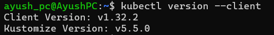
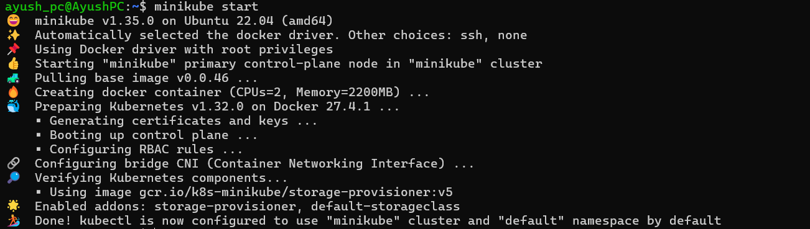
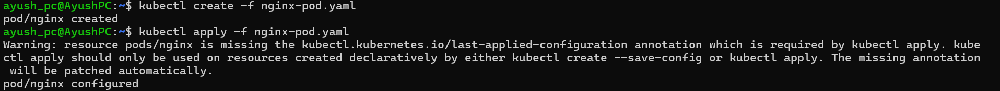
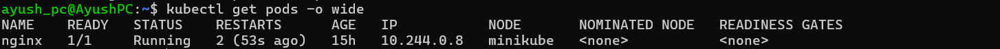
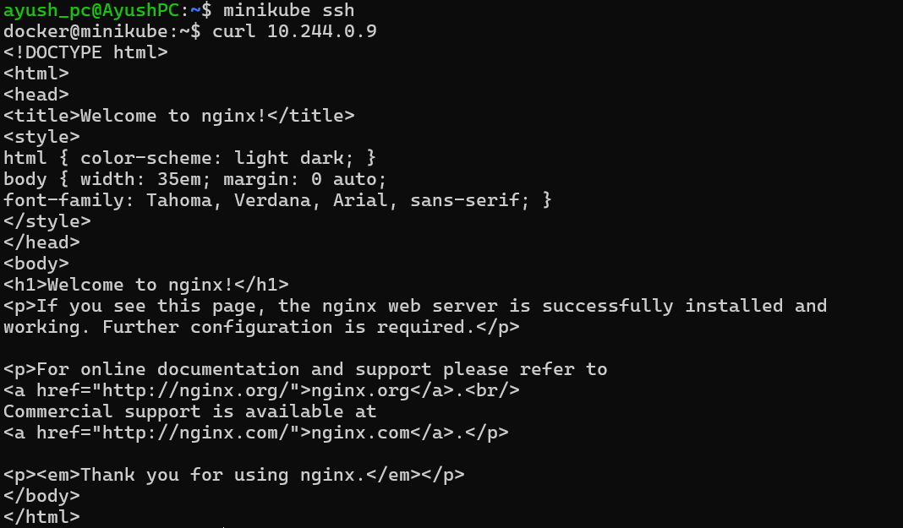
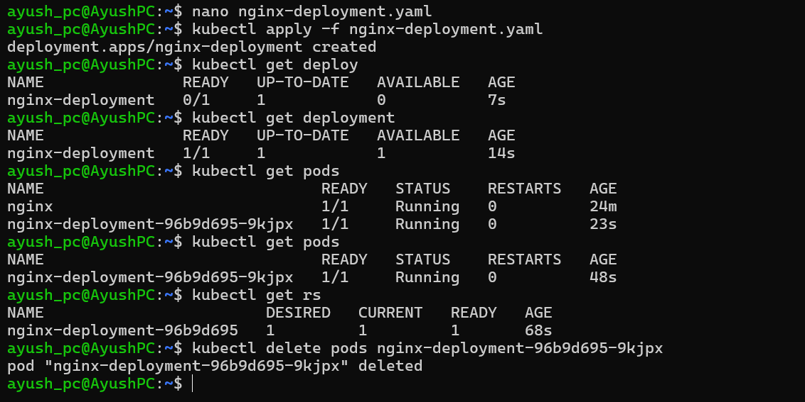
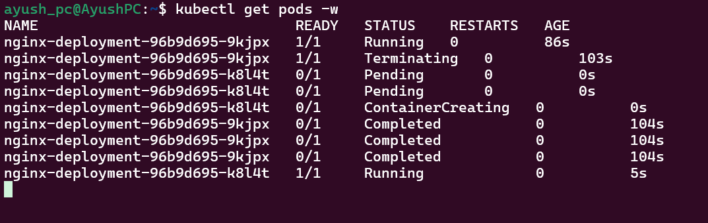

# Deploying Your First Application on Kubernetes Using Minikube

## Introduction
This guide walks you through deploying your first application on Kubernetes using Minikube. You will learn about Containers, Pods, Deployments, using `kubectl`, installing dependencies, and running a simple application.

---

## From Containers to Deployments in Kubernetes
Before diving into Kubernetes, let's understand how applications evolve:

1. **Containers**: Individual runtime environments for applications (e.g., Docker containers).
2. **Pods**: The smallest deployable unit in Kubernetes, consisting of one or more containers.
3. **Deployments**: Kubernetes objects that manage multiple pods and ensure scalability, self-healing, and rolling updates.

---

## Prerequisites
- Windows with WSL2 (Ubuntu) or a Linux system
- Installed `kubectl` and `minikube`

### Installing `kubectl`
Refer to the [Kubernetes official documentation](https://kubernetes.io/releases/download/) for detailed instructions.

#### Install `kubectl` binary on Linux (x86-64):
```sh
curl -LO "https://dl.k8s.io/release/$(curl -L -s https://dl.k8s.io/release/stable.txt)/bin/linux/amd64/kubectl.sha256"
```

#### Validate the downloaded binary:
```sh
echo "$(cat kubectl.sha256)  kubectl" | sha256sum --check
```
**Expected Output:**
```sh
kubectl: OK
```

#### Install `kubectl`:
```sh
sudo install -o root -g root -m 0755 kubectl /usr/local/bin/kubectl
```

#### Verify Installation:
```sh
kubectl version --client
```


---

### Installing Minikube
Refer to the [Minikube documentation](https://minikube.sigs.k8s.io/docs/start/?arch=%2Flinux%2Fx86-64%2Fstable%2Fbinary+download) for installation details.

#### Start Minikube Cluster:
```sh
minikube start
```


#### Interact with the Cluster:
```sh
kubectl get po -A
```
Alternatively:
```sh
minikube kubectl -- get po -A
```

#### Verify Nodes:
```sh
kubectl get nodes
```

---

## Deploying Pods on Kubernetes
Refer to the [Kubernetes Pods documentation](https://kubernetes.io/docs/concepts/workloads/pods/).

### Creating a Pod Configuration File
```sh
nano nginx-pod.yaml
```
Copy the contents from `simple-pods.yaml` containing an Nginx pod running on port 80.

### Equivalent Docker Command:
```sh
docker run -d nginx:14.2 --name nginx -p 80:80
```

### Deploy the Pod:
```sh
kubectl create -f nginx-pod.yaml
kubectl apply -f nginx-pod.yaml
```


### Verifying Pod Status
```sh
kubectl get pods
kubectl get pods -o wide
```


### Checking the Running Pod
```sh
minikube ssh
curl <pod_ip>
```


### Debugging & Logs
```sh
kubectl logs nginx
kubectl describe pod nginx
```

---

## Upgrading to Deployments
Currently, our application is running in a single Pod. If this pod crashes or is deleted, the application will go down. Kubernetes provides **Deployments** to solve this issue using **ReplicaSets**.

### Issue with Single Pod
Run the following to delete the pod:
```sh
kubectl delete pod nginx
```
Now, try accessing it again:
```sh
minikube ssh
curl <pod_ip>
```
You will notice that the application is no longer accessible. This is because we only deployed a single Pod, and there is no mechanism to recreate it automatically.

---

## Deploying an Application Using Deployments
Deployments ensure that pods are automatically restarted if they fail. They also enable scaling and rolling updates.

### Creating a Deployment Configuration File
```sh
nano nginx-deployment.yaml
```
Copy the contents from `nginx-deployment.yaml`.

### Deploying the Application
```sh
kubectl apply -f nginx-deployment.yaml
kubectl get deploy
kubectl get pods
kubectl get rs  # Check the ReplicaSet
```

### Verifying Auto-Healing in Deployments
Open a second terminal and run:
```sh
kubectl get pods -w
```
This command continuously watches pod status in real-time.

Now, delete a running pod:
```sh
kubectl delete pod <pod_name>
```
Observe that a new pod is automatically created to maintain the desired state.

### Deployment Scaling
You can scale up the replicas in `nginx-deployment.yaml`. Modify the `replicas` value from 1 to 3, then run:
```sh
kubectl apply -f nginx-deployment.yaml
kubectl get pods
```
Kubernetes will create additional pods to match the desired state.




---

## Summary
- **Containers** (Docker) allow isolated application runtime environments.
- **Pods** group one or more containers to share storage and networking.
- **Deployments** ensure scalability, auto-healing, and rolling updates using ReplicaSets.

Now you can experiment by increasing replicas, updating images, and even testing rolling updates in Kubernetes!
